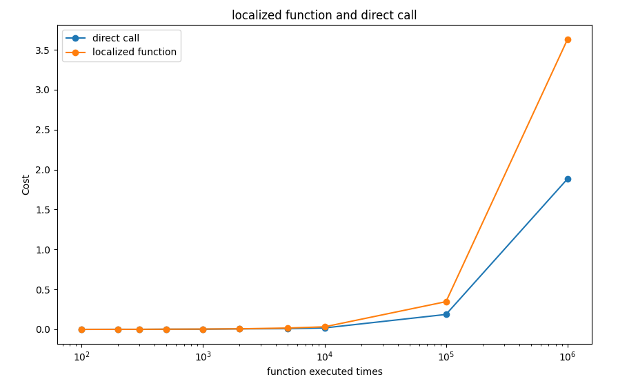

# 调用方法


## 1. 固定函数调用方法

固定函数在脚本中直接使用即可。


## 2. 触发函数调用方法

触发函数采用`重载`的形式进行调用。

例如，如果您想让您的mod在每次角色吃东西的时候触发某件事，您可以在`main.lua`中重新定义这个触发函数：

```lua
function OnEat(personal, item)
    -- your code here...
    return false
end
```


## 3. 模块函数调用方法

游戏的主要逻辑交由一个个逻辑模块（`LogicModule`）运行，每个模块暴露的若干接口。

通常来说，开发者想要调用模块中的函数，可以通过两种方式来进行：

+ 通过某一模块对应的`enum`来获取这一模块提供的接口
+ 通过访问模块名直接访问函数

> 请各位开发者严格区分API文档中的大小写。
>
> 如果您的Lua脚本报错：`attempt to call a nil value (method 'xxxx')`，请优先检查您是否正确区分了API函数的大小写。

### 3.1 (复杂方法)获取接口调用方法

通过某一模块对应的`enum`来获取这一模块提供的接口，例如：

```lua
local GameMgr = CS.GameMgr  	-- GameMgr是C#类型，要用CS这个命名空间
local Module = CS.ModuleEnum
```

之后，你可以通过查询后续文档的`模块名` - `方法名`，来调用接口函数，例如：

```lua
-- PeopleManager模块，执行GetPeopleByID方法
GameMgr.Get(Module.PeopleManager):GetPeopleByID(123)
```

上述代码执行的功能是：

+ 找到`PeopleManager`模块
+ 调用`GetPeopleByID`方法


> Comment: 这样的方法实际上比较复杂，并且可读性较差。推荐用第二种方法调用模块函数。

### 3.2 (推荐方法) 通过`{模块名}:{函数名}`直接访问函数

我们仍以上面的案例进行演示。

为方便使用，`Wasteland Express`开发者已经将这些模块内置到脚本里，可以直接通过模块名访问，例如：

```lua
local p_info = PeopleManager:GetPeopleByID(123)
```


---

所有开发者可以接触的模块以及函数都已经梳理在[后续文档](ModAPIs/module_funcs/)中，大家可自行查阅。

### 3.3 benchmark

有关上面哪个方法更加高效，我们做了一个简单的实验：

+ 第一种方法，就是把Module和GameMgr都保存为`local`变量，然后调用`GetPeopleByID`方法。
+ 第二种方法，直接调用.

有如下结果：



我们可以从中得出如下结论：

+ 如果您要频繁地访问某个API函数，在1000次及以下的时候，都不会对游戏造成太大影响（不会造成卡帧）
+ `直接调用`的方法，也就是我们的**推荐**方法是更加高效的。如果您有高频访问的需求，推荐使用这种方法。


## 4. 其他

以上两种调用方法，都是在调用`ModuleEnum`模块中的类、与其成员方法。

但是实际上，《废土快递》可以被调用的函数远不止这些，如果您想要调用`ModuleEnum`之外的其他函数，上述两种方法都不奏效了。

我们以`打开做饭合成界面`为例。

在给出的API文档中，`打开某个界面`并不在`ModuleEnum`接口中，所以无法从该类中进行调用。

如果您有兴趣使用`ILSpy`等逆向工具查看游戏源码，您也许会找到这样一个类：`UIManager`，与其中的方法：`Open`

所以就有了这样的Lua脚本：

```lua
CS.QxFramework.Core.UIManager.Instance:Open("CookUI")
```

+ `CS`是命名空间，表示在C#中
+ `QxFramework.Core`也是命名空间，是C#中的一个命名空间
+ `UIManager`是一个类
+ `Instance`表示在一个实例中调用。在之前的那些API中，是已经打开了游戏加载了存档之后才能调用的，所以他们默认在实例中。而沿用这里的调用方式，您需要指明实例，所以有了`Instance`的前缀。
+ `:`表示在类外面调用这个类的方法，按照Lua的语法需要使用`:`
+ `Open`: 这是`UIManager`中的成员函数。


> 这种方法非常少用到，当且仅当您不满足于当前所提供的API时使用。


> 慎用ILSpy等逆向工具，**任何泄露源码的行为可能受到法律制裁，请勿触碰红线。**