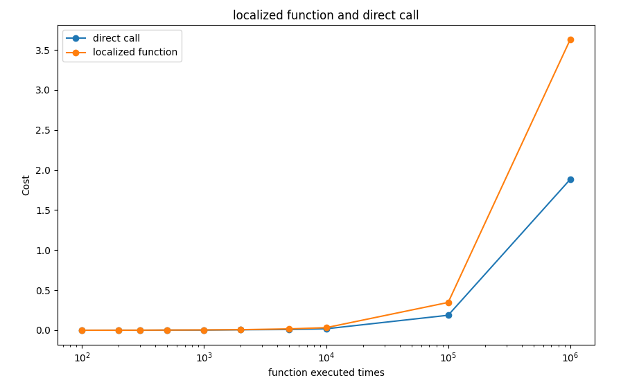

# 模块函数

游戏的主要逻辑交由一个个逻辑模块（`LogicModule`）运行，每个模块暴露的若干接口。

通常来说，开发者想要调用模块中的函数，可以通过两种方式来进行：

+ 通过某一模块对应的`enum`来获取这一模块提供的接口
+ 通过访问模块名直接访问函数


## 1. （复杂方法）获取接口调用方法

通过某一模块对应的`enum`来获取这一模块提供的接口，例如：

```lua
local GameMgr = CS.GameMgr  	-- GameMgr是C#类型，要用CS这个命名空间
local Module = CS.ModuleEnum
```

之后，你可以通过查询后续文档的`模块名` - `方法名`，来调用接口函数，例如：

```lua
-- PeopleManager模块，执行GetPeopleByID方法
GameMgr.Get(Module.PeopleManager):GetPeopleByID(123)
```

上述代码执行的功能是：

+ 找到`PeopleManager`模块
+ 调用`GetPeopleByID`方法


> Comment: 这样的方法实际上比较复杂，并且可读性较差。推荐用第二种方法调用模块函数。


## 2. （推荐方法）`{模块名}:{函数名}`直接访问函数

我们仍以上面的案例进行演示。

为方便使用，Wasteland Express开发者已经将这些模块内置到脚本里，可以直接通过模块名访问，例如：

```lua
local p_info = PeopleManager:GetPeopleByID(123)
```


---

所有开发者可以接触的模块以及函数都已经梳理在后续文档中，大家可自行查阅。


## 3. benchmark

有关上面哪个方法更加高效，我们做了一个简单的实验：

+ 第一种方法，就是把Module和GameMgr都保存为`local`变量，然后调用`GetPeopleByID`方法。
+ 第二种方法，直接调用.

有如下结果：



我们可以从中得出如下结论：

+ 如果您要频繁地访问某个API函数，在1000次及以下的时候，都不会对游戏造成太大影响（不会造成卡帧）
+ `直接调用`的方法，也就是我们的**推荐**方法是更加高效的。如果您有高频访问的需求，推荐使用这种方法。