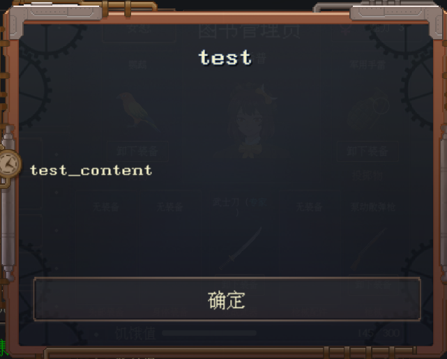

# 简介

> 固有函数就是内置到脚本里的，可以直接调用的函数。


## Save

**函数原型**

```csharp
Save(key, table)
```


**描述**

将table的数据保存到key下面。


**参数**

+ `key`: string ，数据的标志
+ `table` Lua表: **但需要注意必须是Dictionary<string, string>**，也就是说这个table必须是一个字典类型的table，它的键和值的数据类型都是string。


**用例**

```lua
local table = {};

--保存之前触发，用于保存Mod自己的数据
function OnSave(fileName)
	--保存的时候只能保存string对string的字典，不知道具体怎么回事可以直接抄这段代码
	local data = SaveDic();
	for i, n in pairs(table) do
		data:Add(i.PeopleID, n);
	end
	--下面这个方法是用来保存数据的，data必须是Dictionary<string, string>类型
	print("I'm saving data to file: " .. fileName)
	Save("test", data);
	return false;
end
```


## Load

**函数原型**

```csharp
Load(key)
```


**描述**

读取key对应的数据。


**参数**

+ `key`: string ，数据的标志


**返回值**

+ 如果获取到了数据，那么返回`table`
+ 如果没获取到数据，返回`false`或者`nil`


**用例**

```lua
local table = {};

--加载游戏的时候触发
function OnLoad(fileName)
	local temp = Load("test");
	if temp then
		table = {}
		for i, n in pairs(temp) do
			--因为读取的数据是string类型，用之前要转换成number类型（用tonumber方法）
			table[PeopleManager:GetPeopleByID(tonumber(i))] = tonumber(n);
		end
	end
	print("I'm loading data from file: " .. fileName)
	return false;
end
```


## Delete

**函数原型**

```csharp
Delete(key)
```


**描述**

删除key对应的数据。


**参数**

+ `key`: string ，数据的标志


## OpenDialog

**函数原型**

```csharp
OpenDialog(title, content)
```


**描述**

打开对话框


**参数**

+ `title`: string，对话框标题。
+ `content`: string， 对话框内容。

案例：

```lua
function OnDrinkWater(personal)
    OpenDialog("test", "test_content");
end
```

