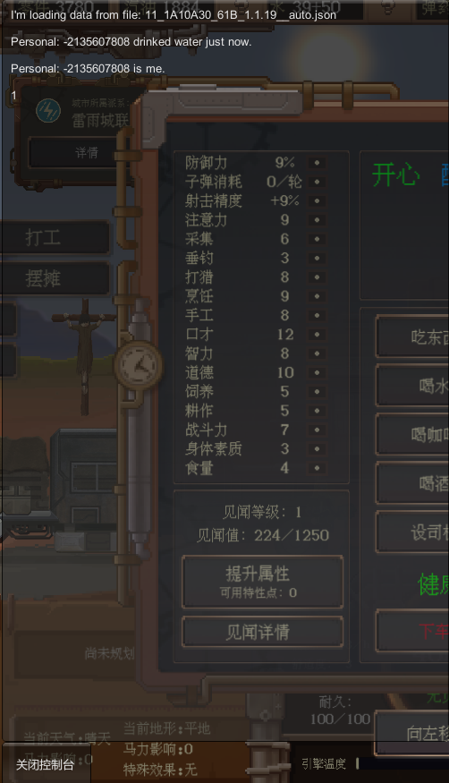

# 快速入门：从简单的案例开始

欢迎来到Mod开发Wiki的`入门界面`！在这里你将学到：

+ 如何配置开发环境
+ 如何创建你的第一个Mod
+ 如何发布你的Mod到创意工坊


## 1. Mod开发前置：控制台

在开始正式的Mod开发之前，首先得配置好自己的开发环境。

废土快递提供了Mod开发的控制台，您可以通过[创意工坊](https://steamcommunity.com/sharedfiles/filedetails/?id=3039284263&searchtext=%E6%8E%A7%E5%88%B6%E5%8F%B0)进行安装。

载入游戏后，可以看到控制台就处于整个游戏界面的`左下角`：

+ 通过Lua脚本的`print`输出结果，可以在这个控制台中实时浏览

<!-- <div align="center">
    
    
</div> -->


<!--  -->

在创意工坊中，可以直接搜索`控制台`，然后通过`订阅`按钮，即可安装该mod，之后重启游戏，就可以看到控制台浮现在你的游戏界面左下角~


## 2. 创建你的第一个Mod

### 2.1 创建Mod文件夹

创建Mod有着规范的文件结构，我们假设您的游戏安装目录是这样的：


您需要再当前目录下，创建一份名为`ModsUpload`的文件夹，像这样：


这个`ModsUpload`文件夹就是您的Mod存放地。

> 需要注意的是，这仅仅只是您的自制Mod存放地，而不是从创意工坊下载下来的Mod存放地。
>
> 从创意工坊下载下来的Mod存放在：steamapps > workshop > content 文件夹中。


之后，在`ModsUpload`文件夹下面，**再创建一个新文件夹**，您可以随意命名，在这里我们取名为`test_mod`。

> `ModsUpload`文件夹是所有Mod文件的集合，而不是单个Mod的存放地，所以需要再创建一个文件夹，放置您的Mod


### 2.2 创建Lua脚本

+ 在我们刚才创建好的`test_mod`文件夹中，创建一个名为`Script`的文件夹，这个文件夹中用于存放您的Lua脚本。

+ 并且，您需要再在`Script`文件夹中，创建一份`main.lua`脚本作为`主执行脚本`

+ 同时，`test_mod`文件夹（也可以称为：您的Mod根目录）下面，放置一张图片，并命名为`Preview.png`，作为您的Mod封面。


综上，一个标准的Mod文件路径分布是这样的：

```
ModsUpload
├─  test_mod
|   ├─  Script
|   |   └─ main.lua
|	└─  Preview.png
|
└─  (your_second_mod_folder)
```


### 2.3 编写Lua脚本

我们将以一个`喝水`的函数为例子，主要目的在于演示如何书写一份`main.lua`。

可以直接把下面的代码复制到`main.lua`中：

```lua
function OnDrinkWater(person)
    -- the parameter "person" is `Personal` type, not table, 
    -- so you cannot iterate through it.
    print(tostring(person) .. " drinked water just now.")
    print(tostring(person.Gender))
    return false
end
```

> 如果暂时不明白代码注释内容的话，可以忽略

然后，您可以重新载入游戏存档，或者重新进入游戏，应该就可以加载这一份脚本Mod了。

您可以点击`人物图表`，找到`喝水`，点击。

之后，您就可以在控制台中看到输出内容。


**更多...**

> Lua脚本Mod仅仅只是废土快递游戏Mod的一种，还有更多自建表、自建配方、自建角色等等内容可以探索，只不过那些并不涉及Lua开发，您可以从创意工坊中下载下来浏览他们Mod的组成成分与功能，此处不再进行赘述。


## 3. 如何发布Mod到创意工坊

在游戏的`Mod`选项中，您可以找到`发布至创意工坊`按钮：


**请确保您有一份Preview.png作为封面**。

之后可以点击此按钮进行上传。

上传完成后，**请联系群主为 mod 添加 tag 。**

> 每次上传 mod 需报备审核，报备审核时请发截图表明 mod 可正常运行。
>
> 未报备 mod 会定期清除。

> 禁止盗用他人 mod 发布，一经发现永久封禁社区并提交至 steam 社区管理员 
>
> steam 创意工坊条例：https://steamcommunity.com/sharedfiles/workshoplegalagreement